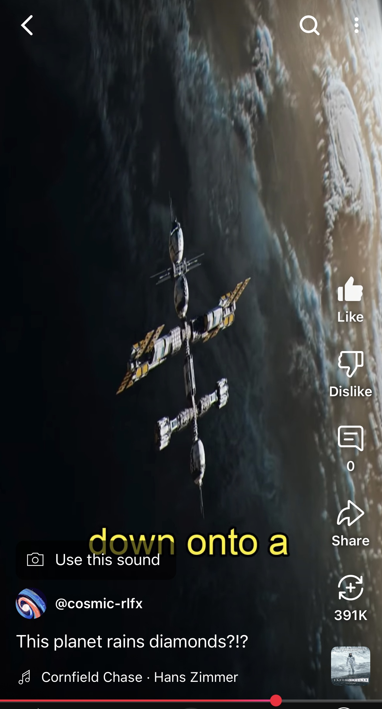

# Automated TikTok Generator

## Overview
This project automates the creation of short, engaging TikTok videos featuring space-themed footage. It downloads copyright-free space videos, generates a script using AI, converts the script into a voiceover, adds subtitles, and compiles everything into a final video.




---

## Features
✅ **Download Copyright-Free Space Videos** (via Pixabay API or YouTube-DL)  
✅ **Generate AI-based Scripts** (Azure OpenAI API)  
✅ **Create AI Voiceovers** (Google Cloud TTS & Azure Cognitive Services)  
✅ **Add Subtitles Dynamically**  
✅ **Compile and Render the Final Video**  


---

## Installation

### Prerequisites
Ensure you have Python installed along with the required libraries:
```sh
pip install gtts yt_dlp google-cloud-texttospeech azure-cognitiveservices-speech openai moviepy requests
```

You will also need API keys for:
- **Pixabay API** (for downloading stock videos)
- **Azure OpenAI API** (for script generation)
- **Google Cloud TTS** (for voiceovers)
- **Azure Cognitive Services** (for alternative voiceover generation)

---

## How It Works
### **1. Download Space-Themed Stock Videos**
```python
def downloadStockFootage(query):
    url = f"https://pixabay.com/api/videos/?key={API_KEY}&q=space+{query}&per_page=14"
    response = requests.get(url)
    data = response.json()
    # Process and download videos...
```
💡 *This function searches Pixabay for space-related clips and downloads them.*

### **2. Generate AI-Based Script**
```python
def generateScriptGPT():
    response = openai.completions.create(
            model="gpt-4",
            prompt="Write a captivating, under-one-minute script about space.",
            max_tokens=150,
            temperature=0.7
        )
    return response['choices'][0]['text'].strip()
```
💡 *This function uses Azure OpenAI GPT-4 to generate an interesting script.*

### **3. Generate AI Voiceover**
```python
def generate_google_cloud_voiceover(script_text, output_audio_file):
    synthesis_input = texttospeech.SynthesisInput(text=script_text)
    voice = texttospeech.VoiceSelectionParams(
        language_code="en-US", name="en-US-Wavenet-D"
    )
    response = client.synthesize_speech(input=synthesis_input, voice=voice, audio_config=audio_config)
    with open(output_audio_file, "wb") as out:
        out.write(response.audio_content)
```
💡 *This function converts text to speech using Google Cloud TTS.*

### **4. Create Video with Subtitles**
```python
def create_video_with_voiceover(script_text, background_video_file, output_video_file):
    audio_file = "voiceover.mp3"
    generate_voiceover(script_text, audio_file)
    video = VideoFileClip(background_video_file)
    subtitles = create_subtitle_clips_dynamically(script_text, audio_file, video.size)
    final_video = CompositeVideoClip([video, *subtitles]).with_audio(AudioFileClip(audio_file))
    final_video.write_videofile(output_video_file, codec="libx264", audio_codec="aac")
```
💡 *This function adds subtitles, syncs voiceovers, and renders the final video.*

---

## Example Usage
Run the script with a chosen space topic:
```python
createBGVideo("final_tiktok.mp4")
script = generateScriptGPT()
create_video_with_voiceover(script, "final_tiktok.mp4", "output_tiktok.mp4")
```
This will generate a **TikTok-ready video** with dynamic subtitles and AI narration.

---

## Output Example


---

## Future Improvements
🔹 Add more AI voice options  
🔹 Improve script generation logic for better storytelling  
🔹 Enhance video transitions and effects  

---

## License
This project is open-source and free to use under the MIT license.

🚀 **Happy Video Creation!** 🚀

